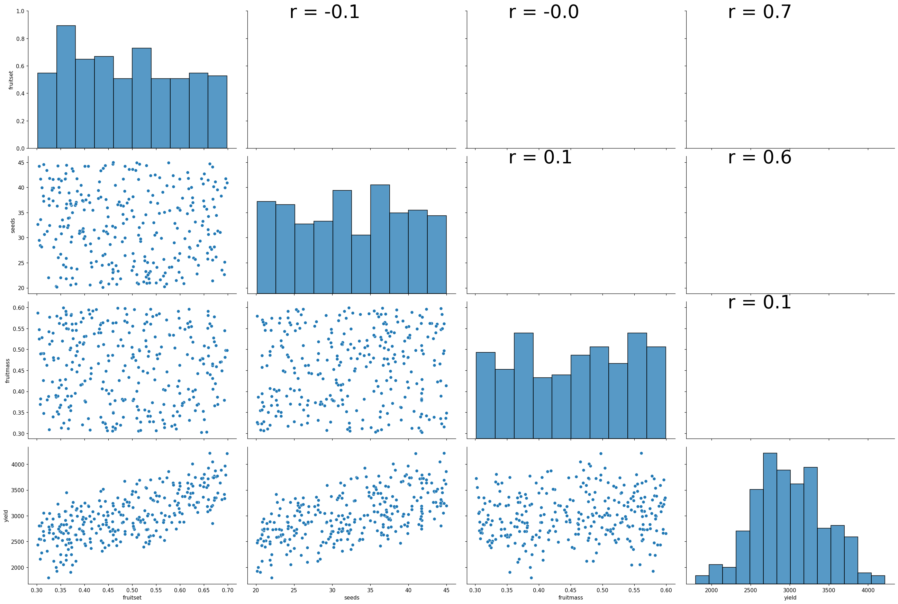
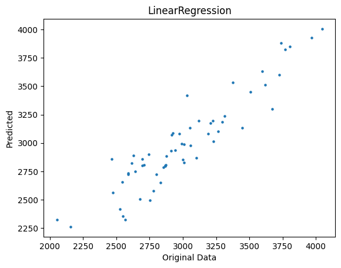
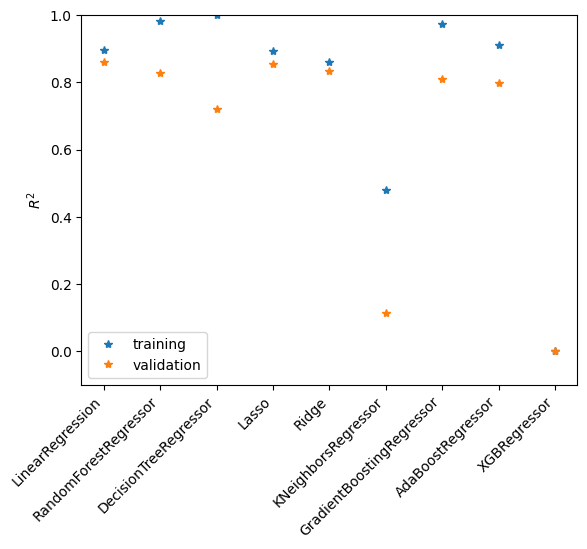
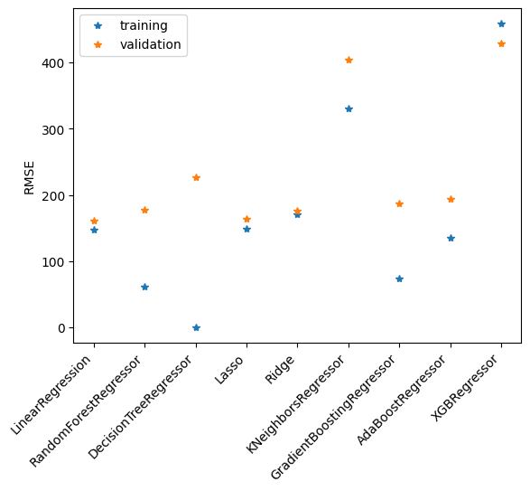
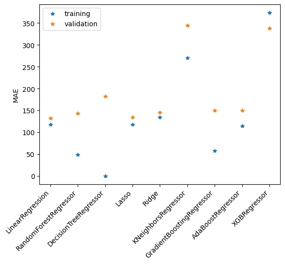
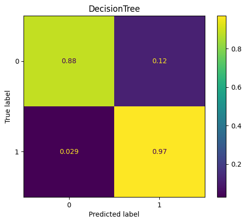
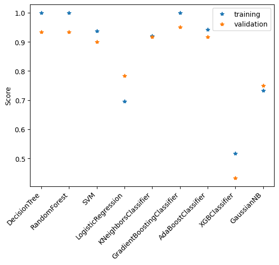
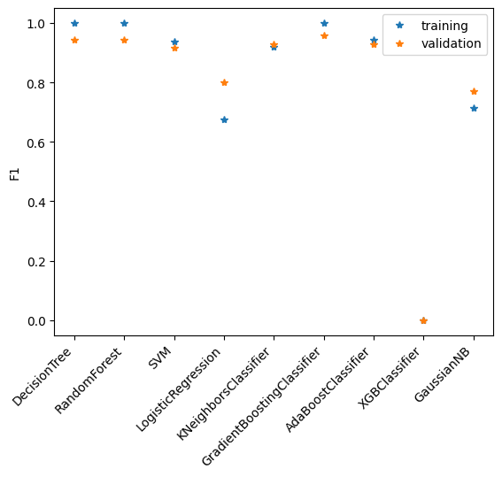
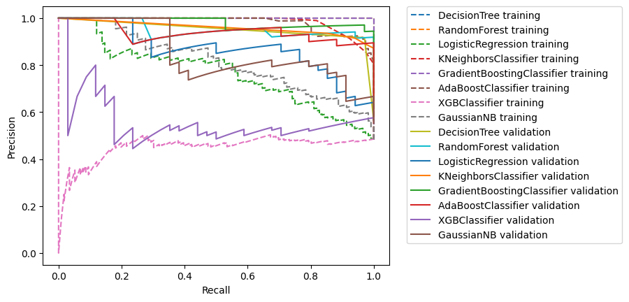

# Examples

Ready-to-run scripts demonstrating `best_model_toolkit`. All of them use
synthetic data generated with scikit-learn, so you can run them directly
without needing your own dataset.

| File | What it shows |
|---|---|
| `plots_gallery_example.py` | A quick tour of every regression plot: correlation heatmap, top-correlated pairplot, per-model test scatter plots, final R2/RMSE/MAE comparison, and the summary table. Start here if you just want to see what the package draws. |
| `plots_gallery_classification_example.py` | Same tour, but for classification: confusion matrix per model, and final Score/F1/Precision/Recall comparison plots. |
| `regression_example.py` | Full regression pipeline: scaling features, running `best_model()` with `grid="Yes"`, and reading the results. |
| `classification_example.py` | Full classification pipeline, including `hue` for the overview plot. |
| `standalone_plots_example.py` | Using `plot_corr_heatmap()` and `plot_pair_grid_top_corr()` on their own, without training any models. |

## Running an example

```bash
pip install best-model-toolkit
python plots_gallery_example.py
```

(or open any of these files in Jupyter / Google Colab and run cell by cell)

## What the plots look like

### Overview plots

Correlation heatmap (`pairplot_type="heatmap"`, the default):


Pairplot limited to the top-correlated features (`pairplot_type="top_corr"`):



### Regression

Per-model test-set scatter plot (predicted vs. actual):



Final comparison across all models:





### Classification

Per-model normalized confusion matrix:



Final comparison across all models:




